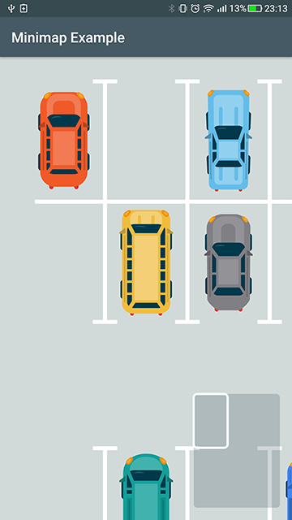
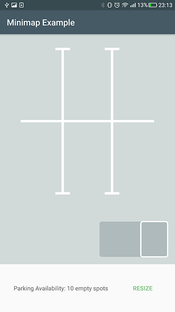
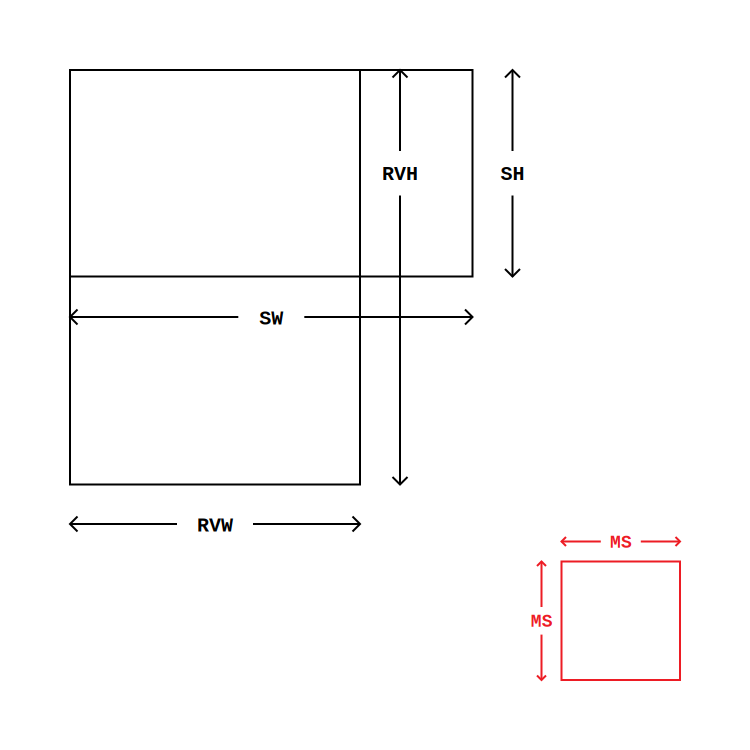

# minimap-view

A minimap view library for Android. The miniature map is usually placed in the corner of the screen, to help the user in orienting himself in a screen with a big Recycler View. Check the example by cloning the repo and starting the example app, or by downloading the APK from [Releases](https://github.com/acolombo25/minimap-view/releases). The example app is a resizable parking lot, showing a few scenarios of the library responding to resizes:




## Download %nbsp; [](https://jitpack.io/#eu.acolombo/minimap-view)

Add the dependency in your app  `build.gradle` with the current version number:
```gradle
implementation 'eu.acolombo:minimap-view:c.v.n'
```

If you haven't done so already for other libraries, you also have to add JitPack in your root `build.gradle`:
```gradle
allprojects {
    repositories {
        ..
        maven { url 'https://jitpack.io' }
    }
}
```

This library is AndroidX only, if you are still using Support libraries you can either migrate your app to AndroidX or you can contribute by downgrading the dependencies and subitting a pull-request, which will be merged in a different branch.

### Get started
Add the minimap in your layout customizing the properties you need:
> XML
```xml
<eu.acolombo.minimap.MinimapView
    android:id="@+id/minimapView"
    android:layout_width="wrap_content"
    android:layout_height="wrap_content"
    android:layout_margin="@dimen/activity_margin"
    app:minimapBackgroundColor="@color/colorMinimap"
    app:minimapBorderWidth="3dp"
    app:minimapCornerRadius="5dp"
    app:minimapMaxSize="160dp"/>
```
Then link it to your RecyclerView:
> Kotlin
```kotlin
recyclerView.minimap(minimapView)
```
> Java
```java
MinimapView minimapView = findViewById(R.id.minimapView)
minimapView.setRecyclerView(recyclerView)
```

For the library to work properly, the <mark>LayoutManager used in your RecyclerView should implement computeHorizontalScrollRange and computeVerticalScrollRange</mark>, not all of them do by default.

## Docs

The MinimapView indicator matches the size of the visible area of the RecycleView, while its background matches the size of the scrollable area of the RecyclerView. Both parts of the MinimapView will auto-update when the RecyclerView visible size or scrollable size will change. The calculations to have the indicator and the background match all the possible cases are not that trivial. To keep ratios and positions correct, there are many different scenarios you have to think about, for example when the size of the RecyclerView is bigger than its scrollable area. So I made a scheme with all the measurement names:



For the moment the library lets you select one max size, and the MinimapView width or height will have to stay inside that size, keeping its form factor. Instead of one max size, having both a max-height and a max-width would be ideal.

### Credits
- [Devunwired's FixedGridLayoutManager](https://github.com/devunwired/recyclerview-playground) - Layout Manager used in the example app
- [Freepik's Car Vector](https://www.freepik.com/free-vector/top-view-of-flat-cars-on-parking-lot_1349624.htm) - Vector graphics used in the example app

### Projects using minimap-view
- [mywellness](https://play.google.com/store/apps/details?id=com.technogym.mywellness) : [dark](docs/screenshots/Screenshot_20181212-000709.png) , [light](docs/screenshots/Screenshot_1544703153.png)
