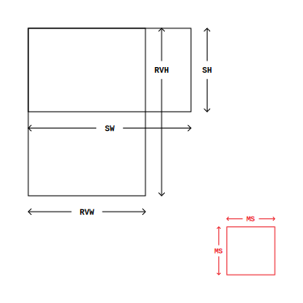

# minimap-view

A minimap view library for Android. The miniature map is usually placed in the corner of the screen, to help the user in orientig himself in a screen with a big Recycler View. Check the example by cloning the repo and starting the example app.

## Screenshots

Example app (parking lot) showind different scenarios and sizes:


## Download   [](https://jitpack.io/#acolombo25/minimap-view)

Add the dependency
```
implementation 'com.github.acolombo25:minimap-view:0.1.0'
```

At the moment only an AndroidX release is available, but I will add a Support version in the next days.

### Get started
Add the minimap in your layout customizing the properties you need
```
<com.fusaimoe.minimap.MinimapView
    android:id="@+id/minimapView"
    android:layout_width="wrap_content"
    android:layout_height="wrap_content"
    android:layout_margin="@dimen/activity_margin"
    app:minimapBackgroundColor="@color/colorMinimap"
    app:minimapBorderWidth="3dp"
    app:minimapCornerRadius="5dp"
    app:minimapMaxSize="160dp"/>
```
Then add it to your Recycler view in this way
```
import com.fusaimoe.minimap.MinimapView.Companion.minimap

recyclerView.minimap(minimapView)
```
Or, if you're using Java, do it this way
```
MinimapView minimapView = findViewById(R.id.minimapView)
minimapView.setRecyclerView(recyclerView)
```

For the library to work properly, the LayoutManager used in your RecyclerView should implement computeHorizontalScrollRange and computeVerticalScrollRange, not all of them do.

## Docs

The MinimapView indicator matches the size of the visible area of the RecycleView, while its background matches the size of the scrollable area of the RecyclerView. Both parts of the MinimapView will auto-update when the RecyclerView visible size or scrollable size will change. The calculations to have the indicator and the background match all the possible cases are not that trivial. To keep correct ratios and positions correct there are many different scenarios you have to think about, for example when the size of the RecyclerView is bigger than its scrollable area... So I made a scheme with all the measurement names


For the moment the library lets you select one max size, and the MinimapView width or height will have to stay inside that size, keeping its form factor the same.

### Credits
- [Devunwired's FixedGridLayoutManager](https://github.com/devunwired/recyclerview-playground) - Layout Manager used in the example
- [Freepik's Car Vector](https://www.freepik.com/free-vector/top-view-of-flat-cars-on-parking-lot_1349624.htm) - Vector graphics used in the example

### Projects using minimap-view
- [mywellness](https://play.google.com/store/apps/details?id=com.technogym.mywellness) - [Screenshot](docs/screenshots/Screenshot_20181212-000709.png)
- [my-virgin-active](https://play.google.com/store/apps/details?id=it.virginactive.android) - [Screenshot]()
